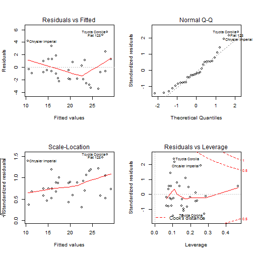

## MPG Model Selector

This is a peer assessment project for Developing Data Product course by Coursera. Following are to be delivered in this assignment:
- A shiny application hosted in Shiny server:
[Shiny App](https://y2charlie.shinyapps.io/DevelopingDataProductShiny/)
- A 5 pages Slidify presentation hosted in Rpub.
- Git repository containing the source file:
        - here

--- .class #id 

## The Shiny Application

This application aims to demonstrate the basic implemetation of Shiny application.The application is hosted at

The application  offers the following:
- Allow user to choose from 1 of 3 regressor combinations available.
- Update Adjusted Rsquare, model coefficient and residual plot based on the chosen regressor combination.

--- .class #id 

## The Data and Modelling technique

mtcars data is used in assignment. Linear regression technique is used for comparison of model fitness against different combination of regressors.


```r
head(mtcars)
```

```
##                    mpg cyl disp  hp drat    wt  qsec vs am gear carb
## Mazda RX4         21.0   6  160 110 3.90 2.620 16.46  0  1    4    4
## Mazda RX4 Wag     21.0   6  160 110 3.90 2.875 17.02  0  1    4    4
## Datsun 710        22.8   4  108  93 3.85 2.320 18.61  1  1    4    1
## Hornet 4 Drive    21.4   6  258 110 3.08 3.215 19.44  1  0    3    1
## Hornet Sportabout 18.7   8  360 175 3.15 3.440 17.02  0  0    3    2
## Valiant           18.1   6  225 105 2.76 3.460 20.22  1  0    3    1
```

--- .class #id 

## The Input and Output

3 regressor combinations are made available as radio button option. Following is the sample output

```
##                Estimate Std. Error   t value     Pr(>|t|)
## (Intercept) 36.14653575 3.10478079 11.642218 4.944804e-12
## cyl         -0.74515702 0.58278741 -1.278609 2.119166e-01
## hp          -0.02495106 0.01364614 -1.828433 7.855337e-02
## wt          -2.60648071 0.91983749 -2.833632 8.603218e-03
## am           1.47804771 1.44114927  1.025603 3.141799e-01
```

```
## [1] 0.8266657
```




